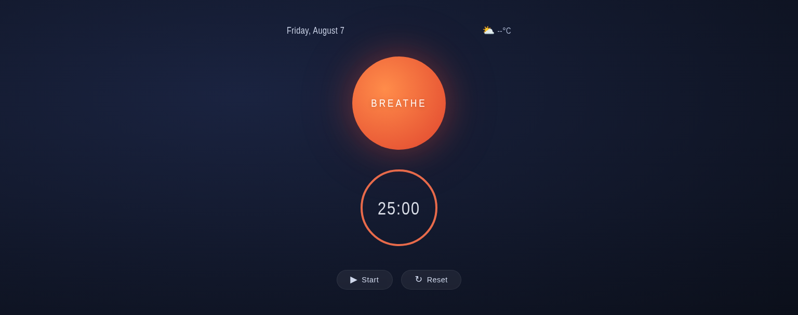

# Zen Ambient Dashboard

A minimalist focus timer and breathing prompt with a calm, dark ambient aesthetic.

## Features

- **25‑minute focus timer** (Pomodoro‑style) with a circular progress ring
- **Breathing prompt** – tap the large glowing circle to start/pause the timer
- **Start / Pause / Reset** controls
- **Keyboard shortcuts** – press `Space` to start/pause, `R` to reset
- **Live date** display
- **Weather placeholder** – ready for API integration (currently shows `--°C`)
- Fully responsive – works on desktop and mobile

## Usage

1. Click the **Start** button (or press `Space`) to begin the countdown.
2. Click **Pause** (or press `Space` again) to pause.
3. Click **Reset** (or press `R`) to reset back to 25:00.
4. Tap the large **BREATHE** circle to toggle start/pause.

## Technologies

- Pure HTML / CSS / JavaScript – no external dependencies
- SVG for the timer ring
- CSS gradients and subtle glow effects

## Live Demo

[https://billybox1926-jpg.github.io/Zen-Ambient-Dashboard/](https://billybox1926-jpg.github.io/Zen-Ambient-Dashboard/)
